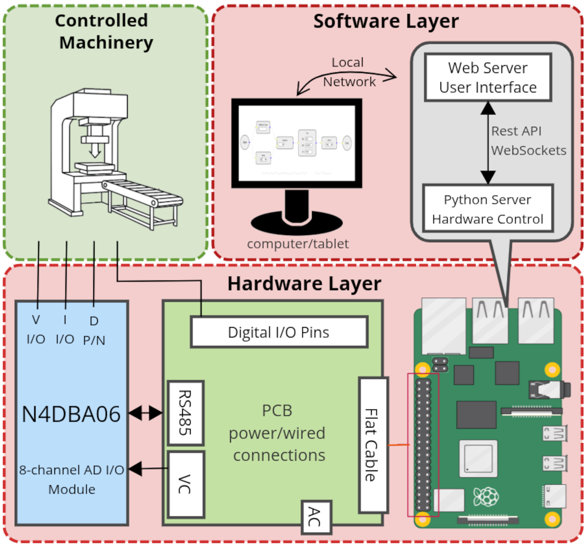

# An Open-Source, Low-Cost PLC Framework with FBD-Based Graphical Programming

Autors: Carlos Roberto Moratelli, Leonardo dos Santos Schmitt, Ciro André Pitz.

Published in IEEE Latin America Transactions (Submition ID: 9892)


> Low‑cost, open‑source PLC framework that runs fully on a Raspberry Pi and lets you **program automation logic visually** (Function Block Diagram – FBD) in the browser.



This repository (`openplc-rpi/.github`) hosts the **organization‑wide README**. It documents how to use the project and links to the code repositories.

- **Backend (Python)** → <https://github.com/openplc-rpi/back-clp>
- **Frontend (ReactJS)** → <https://github.com/openplc-rpi/front-clp>
- **Raspberry Shield** → <https://github.com/openplc-rpi/shield-clp-rpi>
---

## Table of Contents
- [What is this?](#what-is-this)
- [Main features](#main-features)
- [Architecture](#architecture)
- [Code repositories](#code-repositories)
- [Backend API](#backend-api)
- [Run locally (simulation)](#run-locally-simulation)
- [Run on Raspberry Pi (hardware)](#run-on-raspberry-pi-hardware)
- [Using the Web UI](#using-the-web-ui)
- [Projects & data logging](#projects--data-logging)
- [Docker on Raspberry Pi](#docker-on-raspberry-pi)
- [Troubleshooting](#troubleshooting)

---

## What is this?
This project implements a **PLC‑like controller** composed of two applications:

- **Backend** — a Python server that exposes a REST API and WebSockets, executes your logic as a **Directed Acyclic Graph (DAG)**, and controls I/O (GPIO + RS485 **N4DBA06** module).
- **Frontend** — a ReactJS web application that provides an **FBD‑style editor** (drag & drop blocks; connect with edges), communicates with the backend, and shows live values.

It is intended for **education, research, and small/medium automation** where low cost and flexibility matter more than formal PLC certifications.

---

## Main features
- **Visual programming** with blocks: *Input, Output, Operation (+,−,×,÷), Decision (comparators), And/Or/Xor, Switch, Equation, PID, ValueOf, ReferenceValue, Start/End*.
- **Live execution**: the backend executes nodes topologically and streams **edge values** via WebSocket (`update` events) to the UI.
- **Hardware control**:
  - Raspberry Pi **GPIO** pins.
  - **RS485/Modbus RTU** I/O via the **N4DBA06** (8‑channel A/D I/O) module.
- **Portable**: runs on x86 in **simulation** (no hardware needed) and on ARM (Raspberry Pi) with real I/O.
- **Extensible**: add new node types by subclassing `NodeProcessor` on the backend and adding a JSX block on the frontend.

---

## Architecture
**Frontend (React + `@xyflow/react`)** builds and saves the FBD graph as JSON.  
**Backend (Flask + Flask‑RESTful + Flask‑SocketIO + NetworkX)** loads that JSON into a DAG and continuously executes it:

1. Read **inputs** (GPIO / N4DBA06).
2. Traverse nodes in **topological order**, calling each node’s `process()`.
3. **Propagate** each result to successor edges.
4. **Write outputs** (GPIO / N4DBA06) and **emit** live edge values via WebSocket.

The whole stack runs on a **Raspberry Pi** and can be accessed from any device in the **local network**.

---

## Code repositories
- **Backend (Python)**: <https://github.com/openplc-rpi/back-clp>

  Contains: `app.py`, REST endpoints, executor/DAG engine, node processors, N4DBA06 Modbus driver, sample `.flow` projects, and `requirements.txt`.
- **Frontend (ReactJS)**: <https://github.com/openplc-rpi/front-clp>

  Contains: React Flow canvas, block components, sidebar, WebSocket client, and `.env` templates.
- **Raspberry Shield**: <https://github.com/openplc-rpi/shield-clp-rpi>

  Contains: Eletric project and garbers to a shield PCB. 


---

## Backend API

Base URL (default): `http://<host>:5000/app/v0.1`

- **`GET /io_ports`** → lists configured input/output port names (from `app.conf`).

- **`GET /projects`** → lists available `*.flow` files.

- **`GET /projects?name=<file.flow>`** → loads a project by name.

- **`POST /projects`** with JSON body:

  ```json
  { "project_name": "my.flow", "flowchart": { "nodes": [...], "edges": [...], "viewport": {...} } }
  ```
  Saves/overwrites in the backend `projects/` folder.
- **`PUT /start`** with JSON body `{ "project": "PID.flow", "state": "start" }` or `"stop"` — starts/stops the executor.

  When running, the server **emits** WebSocket events:

  - channel: `update`

  - payload: list of `[edgeId, value]` pairs (live edge values).

> The WebSocket URL is configurable via `REACT_APP_SOCKETIO_URL` in the frontend `.env`.

---

## Run locally (simulation)
Clone both repositories side‑by‑side (same parent folder):

```bash
git clone https://github.com/openplc-rpi/back-clp.git
git clone https://github.com/openplc-rpi/front-clp.git
```

1) **Backend**
```bash
cd back-clp
python3 -m venv .venv && source .venv/bin/activate
pip install -r requirements.txt
python app.py               # serves on 0.0.0.0:5000
```

2) **Frontend**
```bash
cd ../front-clp
cp .env .env.local          # edit if backend not on localhost
npm install
npm start                   # serves on http://localhost:3000
```

Open the UI → **Load** a sample (e.g., `PID.flow`) → **Run**.

---

## Run on Raspberry Pi (hardware)

### Prerequisites
- Raspberry Pi **3B+ or newer** (32‑/64‑bit Raspberry Pi OS).
- Enable serial & GPIO:
  ```bash
  sudo raspi-config   # Interface Options → Serial (disable login shell, enable HW)
  # Reboot after changes
  ```
- Connect the **N4DBA06** via **RS485** (typically `/dev/ttyUSB0`), and wire GPIOs.
- Permissions when running (esp. with Docker): grant access to `/dev/ttyUSB0` and `/dev/gpiomem`.

### Configure the backend
Edit `back-clp/app.conf`:
- `serial.port` → `/dev/ttyUSB0` (or your adapter)
- `Ports.in_ports` / `Ports.out_ports` → logical names to expose
- `save.should_save = true|false` → append edge values to `data.csv`

### Run (native)
```bash
# Backend on the Pi
cd back-clp
python3 -m venv .venv && source .venv/bin/activate
pip install -r requirements.txt
python app.py

# Frontend on the Pi (or another host)
cd ../front-clp
# Set backend URLs to the Pi IP (e.g., 192.168.1.50) in .env
npm install
npm run build
npx serve -s build -l 3000    # or any static server
```

Open: `http://<pi-ip>:3000`

---

## Using the Web UI
- **Blocks panel**: drag **Input**, **Operation**, **Decision**, **And/Or**, **Switch**, **Equation**, **PID**, **ValueOf**, **ReferenceValue**, **Output**, **Start**, **End** into the canvas.
- Draw **edges** to define signal flow.
- **Top bar**: *Delete*, *Clear*, *Save*, **Run/Stop**.
- **Projects list** (right): click to load a saved `.flow` project.
- When running, edge **labels update live** with current values.

### Extending with new blocks
- **Backend**: subclass `NodeProcessor` (in `back-clp/nodes.py`) and implement `process(self, parent_values)`.
- **Frontend**: create a JSX component (copy an existing one), add it to the sidebar, and register it in `App.js` `nodeTypes`.

---

## Projects & data logging
- Project files: `back-clp/projects/*.flow` (JSON the UI can load/save).
- If `save.should_save = true`, the executor appends live **edge values** to `data.csv` in the backend folder.

---

## Docker on Raspberry Pi

> Build **on the Pi** or use `docker buildx` to target ARM.

### Backend (build & run)
```bash
cd back-clp
docker build -t plc-backend .

docker run -d --name plc-backend --restart unless-stopped   --device /dev/ttyUSB0   --device /dev/gpiomem   -p 5000:5000 plc-backend
```

### Frontend (build & run)
```bash
cd ../front-clp
docker build -t plc-frontend .

docker run -d --name plc-frontend --restart unless-stopped   -p 3000:80 plc-frontend
```

> If frontend and backend run on different hosts, rebuild the frontend with `.env` pointing to the backend URL (Create React App **bakes** env vars at build time).

### docker‑compose (optional, parent folder containing both repos)
```yaml
version: "3.8"
services:
  backend:
    build: ./back-clp
    ports: ["5000:5000"]
    devices:
      - "/dev/ttyUSB0:/dev/ttyUSB0"
      - "/dev/gpiomem:/dev/gpiomem"
    restart: unless-stopped

  frontend:
    build: ./front-clp
    ports: ["3000:80"]
    depends_on: [backend]
    restart: unless-stopped
```
Run:
```bash
docker compose up -d --build
```

---

## Troubleshooting
- **CORS**: the backend enables CORS for development (`cors_allowed_origins='*'`). If reverse‑proxying, adapt as needed.
- **Serial not found**: check RS485 adapter path (`/dev/ttyUSB0`) and user permissions. With Docker, pass the device (`--device /dev/ttyUSB0`).
- **GPIO permission**: ensure `/dev/gpiomem` is present; with Docker, pass the device. Natively, add user to the `gpio` group and relogin.
- **No live updates**: verify the WebSocket URL in the frontend `.env` matches the backend address (`REACT_APP_SOCKETIO_URL`).
- **Performance**: the executor loops continuously; tune `UPDATE_INTERVAL` and consider `PREEMPT_RT` kernels for hard real‑time needs.

---

### License
This project is research/education oriented and provided as‑is under an open‑source license MIT (https://opensource.org/licenses/MIT).

.

---

**Credits**: Based on the work by Carlos R. Moratelli, Leonardo S. Schmitt, and Ciro A. Pitz.
